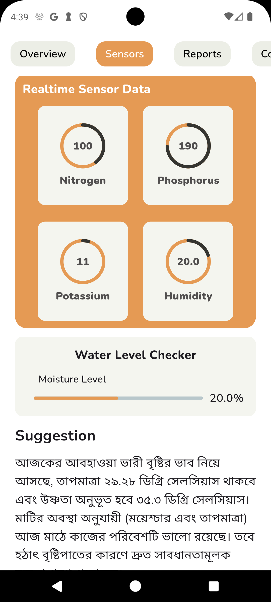
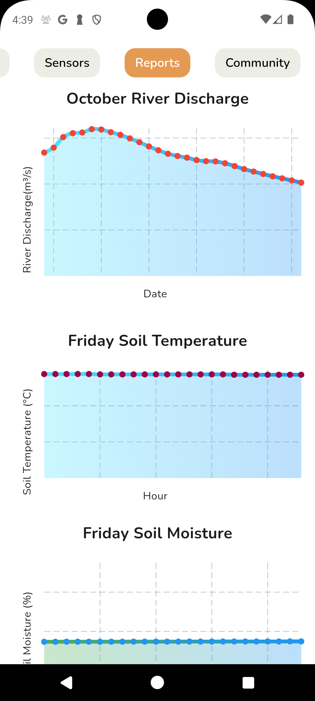
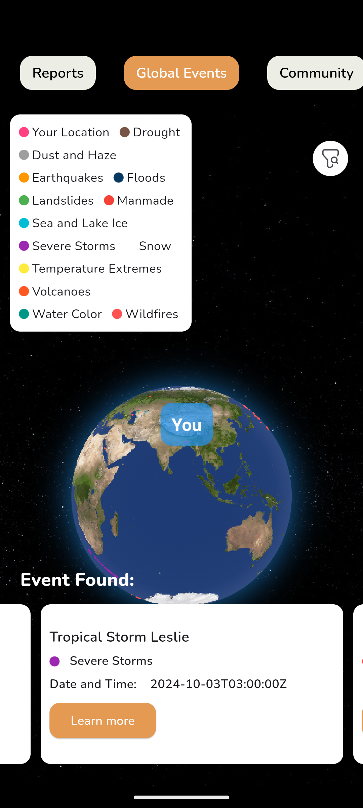
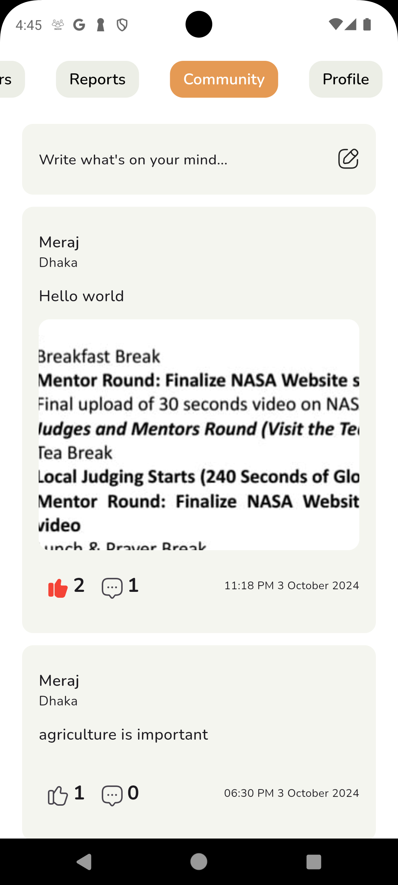
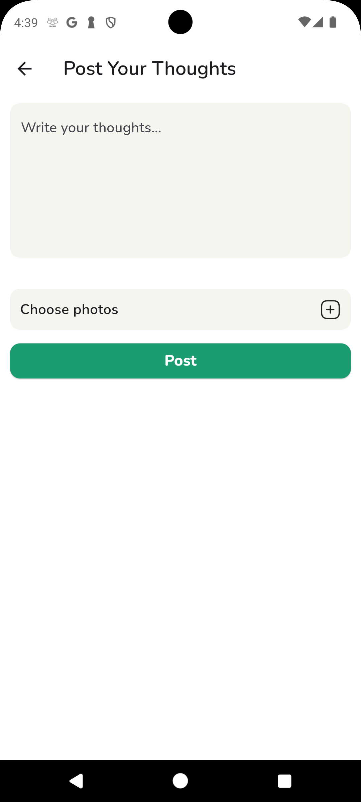
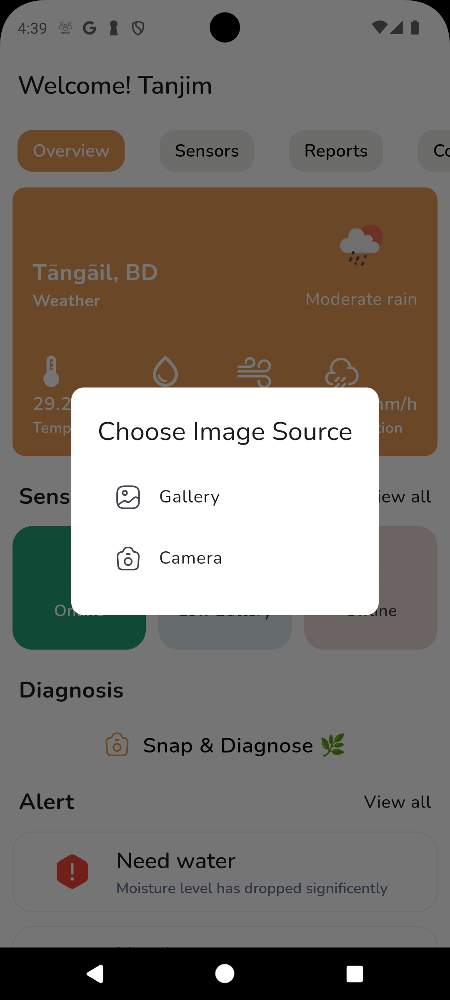
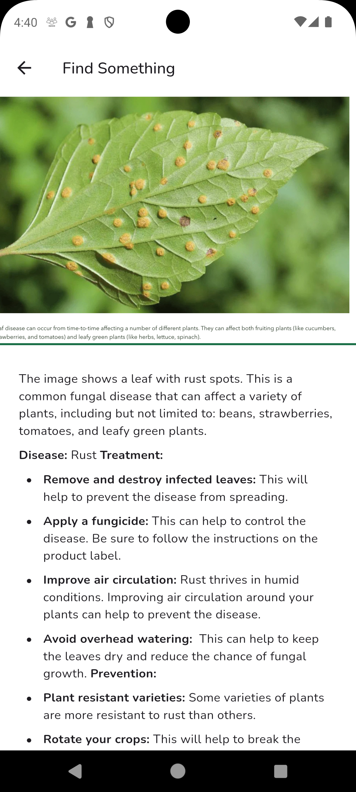

# 🌱 Agrosour


## List of Contents

- [Introduction](#-download-agrosour-app)
- [Features](#-features)
- [Demo](#-demo)
- [Installation](#%EF%B8%8F-setup-instructions)
- [Firebase Database Schema](#firebase-database-schema)
- [Contact](#-contact)

---


## 📥 Download Agrosour App

<a href="https://raw.githubusercontent.com/imtangim/Agrisour/master/assets/app/app1.apk" download style="display: inline-block; padding: 10px 20px; font-size: 16px; color: #fff; background-color: #007bff; text-align: center; text-decoration: none; border-radius: 5px; box-shadow: 0 2px 5px rgba(0, 0, 0, 0.2);">Download App</a>

**Agrosour** is an innovative mobile solution designed to assist farmers with precision agriculture by utilizing sensors, AI, and real-time data to optimize crop yield, soil health, and overall farming efficiency. Learn about global natural occurance through Nasa.

## 🚀 Features

- **User Profile**: Personalized profiles for farmers to track and manage their agricultural activities.
- **Google Authentication**: Secure sign-in using Google accounts.
- **Real-time Data Collection**: Collects real-time data from connected sensors, giving farmers up-to-the-minute insights on their land.
- **NPK Sensor Integration**: Real-time monitoring of nitrogen, phosphorus, and potassium levels.
- **Soil Moisture & Temperature Monitoring**: Access hourly data to optimize irrigation and soil conditions.
- **Flood Sensing**: Receive alerts when flood conditions are detected in your area.
- **Interactive Global Natural Event Showcase**: See natural events including flood, volacanic explosion, manmade fire etc event with interactive screen.
- **AI-based Recommendations**: Get AI-driven suggestions to enhance crop health and yield.
- **Leaf Disease Detection**: Capture photos of leaves and get instant feedback on possible diseases.
- **Community**: Post, delete, and interact with other farmers in a community to share insights and best practices.
- **Post Creation, Deletion, and Interactivity**: Farmers can create posts, delete their content, and engage with the posts of others to foster a collaborative environment.
- **Weather Forecast**: Local weather forecasting for better decision-making.

## 🎥 Demo

[Agrosour App Demo ](https://www.youtube.com/watch?v=hz2hnEkhN9M)

Click the image above to watch a quick demo of the app in action.

## 📱 Screenshots

          

## 🛠️ Setup Instructions

To get started with the Agrosour App, follow these steps for the initial build:

### Prerequisites

Make sure you have the following installed:

- **Flutter SDK** (version 3.0 or higher)
- **Android Studio** or **VSCode** with Flutter/Dart extensions
- **Firebase account** with a configured project

### 1. Clone the Repository

```bash
git clone https://github.com/imtangim/Agrosour.git
cd Agrosour
```

### 2. Install Dependencies

Navigate to the project folder and install the required packages:

```bash
flutter pub get
```

### 3. Set Api key

Navigate to the project `lib/core/theme/keys.dart`:

```bash
class KeysForApi {
    static const String geminiKey =  "Your gemini key";
    static const String openWeatherKey = "You open weather api key";
}
```

### 4. Set Up Firebase

1. Visit [Firebase Console](https://console.firebase.google.com/), create a new project, and register your Android and iOS apps.
2. Create Project and add flutter app.

### 5. Set Up Google Authentication

1. In the [Firebase Console](https://console.firebase.google.com/), go to **Authentication** > **Sign-in method**.
2. Enable **Google** as a sign-in provider.
3. For Android:

   - Ensure that you have added the correct SHA-1 and SHA-256 keys in your Firebase project settings.
   - You can get the SHA keys using the following command (replace `path_to_keystore` and `alias_name` with your values):

   ```bash
   keytool -list -v -keystore path_to_keystore -alias alias_name -storepass your_password
   ```

4. For iOS:

   - Ensure that **reversed client ID** from the downloaded `GoogleService-Info.plist` is correctly set in your Xcode project under the URL schemes.

5. Download the `google-services.json` (for Android) and `GoogleService-Info.plist` (for iOS) and place them in the appropriate directories:
   - **For Android**: Place `google-services.json` in `android/app/`.
   - **For iOS**: Place `GoogleService-Info.plist` in `ios/Runner/`.

### 6. Run the App

For Android:

```bash
flutter run
```

For iOS:

```bash
flutter run --dart-define=FLUTTER_BUILD_MODE=debug
```

### 7. Configure NPK Sensor

- Ensure that your NPK sensor is properly connected and configured with the app. Refer to the documentation for sensor calibration.
  Here’s a nicely formatted schema for the real-time database that you can add to your Markdown file:

### 8. AI-Based Leaf Disease Detection

- Make sure to enable camera access to take pictures for disease detection.

### 9. Real-time Data Collection

- Set up and calibrate the sensors for collecting soil moisture, temperature, and flood conditions.

## 📊 Realtime Database Schema For Firebase Realtime Database

### Database URL

```
https://you-project.firebaseio.com/
```

### Schema Structure

```json

  "sensor_data":{
    "sensor_id": {
      "humidity": 0.6,
      "moisture": 0.8,
      "nitrogen": 110,
      "phosphorus": 130,
      "potassium": 110,
      "temperature": 30
   }
  }

```

### Explanation of Fields

- **humidity**: The current humidity level measured in percentage (0.0 - 1.0).
- **moisture**: The soil moisture level measured in percentage (0.0 - 1.0).
- **nitrogen**: The nitrogen content in the soil (in mg/kg).
- **phosphorus**: The phosphorus content in the soil (in mg/kg).
- **potassium**: The potassium content in the soil (in mg/kg).
- **temperature**: The current temperature measured in degrees Celsius.

This schema captures the essential sensor data required for monitoring agricultural conditions, aiding farmers in making informed decisions.

___

# Firebase Database Schema

This project uses **Firebase Firestore** and **Firebase Realtime Database** for handling user data, posts, comments, and sensor data in real-time. The structure below outlines the database collections, fields, and their relationships, along with a description of a function that listens for changes in the Realtime Database and updates Firestore accordingly.

## Firestore Database

Firestore stores collections such as `users`, `posts`, `comments`, and `Sensors`. Each of these collections has a structured document format explained below.


### 1. **Users Collection**

The `users` collection stores user profiles, including basic contact information and a reference to linked sensor data.

#### Structure:
```
users
│
├── {user_uid_1}
│   ├── address: ""
│   ├── email: "user@example.com"
│   ├── mobile: "123456789"
│   ├── name: "John Doe"
│   ├── sensor_id: "sensor_id_1"
│   └── uid: "K0ZUBJVMj3Yyl1Lo1z2ontj5dvx1"
```

#### Field Explanations:

- **address**: The user's address. Stored as a string.
- **email**: The user's email address for account identification. Stored as a string.
- **mobile**: The user's phone number. Stored as a string.
- **name**: The full name of the user. Stored as a string.
- **sensor_id**: A unique identifier for the sensor data associated with the user. This field links the user to sensor data in the `Sensors` collection. Stored as a string.
- **uid**: The user's unique identifier in Firebase Authentication. Stored as a string.

---

### 2. **Posts Collection**

The `posts` collection stores content shared by users, including text, images, comments, and reactions.

#### Structure:
```
posts
│
├── {post_id_1}
│   ├── comment (Array)
│   │   └── [0]: "comment_uid_1"
│   ├── image_link: null
│   ├── image_list (Array)
│   │   └── [0]: "image_url_1"
│   ├── post: "Post content"
│   ├── post_id: "8f837de8-85fe-42c7-b265-367f5e3b6e50"
│   ├── post_user_uid: "user_uid_1"
│   ├── reaction (Array)
│   │   └── [0]: "user_uid_2"
│   └── timestamp: "2024-10-03 11:00:39 UTC+6"
```

#### Field Explanations:

- **comment**: An array of comment IDs related to this post. Each ID links to a document in the `comments` collection.
- **image_link**: A direct URL to a single image related to the post (if present). It can be `null` if no image is provided.
- **image_list**: An array of URLs for multiple images uploaded with the post. Each element stores the URL of an image.
- **post**: The actual content of the post (text). Stored as a string.
- **post_id**: A unique identifier for the post. Stored as a string.
- **post_user_uid**: The unique identifier of the user who created the post. Links back to the `users` collection. Stored as a string.
- **reaction**: An array of user UIDs who reacted (liked or interacted) with the post.
- **timestamp**: The time when the post was created. Stored as a timestamp.


### 3. **Comments Collection**

The `comments` collection stores individual comments made on posts.

#### Structure:
```
comments
│
├── {comment_id_1}
│   ├── commentid: "6bace055-9ac9-4956-9324-0d009e42448c"
│   ├── postID: "8f837de8-85fe-42c7-b265-367f5e3b6e50"
│   ├── text: "This is a comment"
│   ├── timestamp: "2024-10-04 16:39:32 UTC+6"
│   └── userid: "user_uid_2"
```

#### Field Explanations:

- **commentid**: A unique identifier for the comment. Stored as a string.
- **postID**: The unique ID of the post the comment is associated with. Links back to the `posts` collection.
- **text**: The content of the comment. Stored as a string.
- **timestamp**: The time when the comment was posted. Stored as a timestamp.
- **userid**: The unique ID of the user who made the comment. Links back to the `users` collection.

---

### 4. **Sensors Collection**

The `Sensors` collection stores sensor data that is linked to specific users. Each document contains environmental data such as temperature, moisture, and nutrients.

#### Structure:
```
Sensors
│
├── {random_sensor_doc_id_1}
│   ├── humidity: 0.6
│   ├── moisture: 0.8
│   ├── nitrogen: 110
│   ├── phosphorus: 130
│   ├── potassium: 110
│   ├── temperature: 30
│   ├── sensor_ID: "sensor_id_1"
│   └── timeStamp: "2024-10-03 11:00:39 UTC+6"
```

#### Field Explanations:

- **humidity**: The relative humidity level in percentage (0.6 = 60%). Stored as a float.
- **moisture**: The soil moisture level. Stored as a float.
- **nitrogen**: The nitrogen level in the soil. Stored as an integer.
- **phosphorus**: The phosphorus level in the soil. Stored as an integer.
- **potassium**: The potassium level in the soil. Stored as an integer.
- **temperature**: The current temperature in degrees Celsius. Stored as an integer.
- **sensor_ID**: A unique identifier that links the sensor data to a specific user in the `users` collection.
- **timeStamp**: The time when the sensor data was recorded. Stored as a timestamp.


## Firebase Realtime Database

The Firebase **Realtime Database** stores sensor data that is updated in real-time and used for live monitoring. This data is periodically pushed to Firestore when changes are detected.

### Structure:
```
sensor_data
│
├── {sensor_id_1}
│   ├── humidity: 0.6
│   ├── moisture: 0.8
│   ├── nitrogen: 110
│   ├── phosphorus: 130
│   ├── potassium: 110
│   └── temperature: 30
│
├── {sensor_id_2}
│   ├── humidity: 0.7
│   ├── moisture: 0.75
│   ├── nitrogen: 115
│   ├── phosphorus: 125
│   ├── potassium: 120
│   └── temperature: 29
```

#### Field Explanations:

- **humidity**: The current humidity level in percentage. Stored as a float.
- **moisture**: The soil moisture level. Stored as a float.
- **nitrogen**: The nitrogen level in the soil. Stored as an integer.
- **phosphorus**: The phosphorus level in the soil. Stored as an integer.
- **potassium**: The potassium level in the soil. Stored as an integer.
- **temperature**: The current temperature in degrees Celsius. Stored as an integer.


## Connections Between Collections

- **User and Posts**:  
  Each user can create multiple posts, and each post references the user through `post_user_uid`.
  
- **Posts and Comments**:  
  Posts are linked to their comments through the `comment` array, which holds comment IDs. Each comment is linked back to the corresponding post via `postID`.
  
- **User and Comments**:  
  Users are linked to comments via the `userid` field in the `comments` collection.
  
- **User and Sensors**:  
  The `sensor_id` in the `users` collection links each user to their respective sensor data in the `Sensors` collection.

- **Realtime Sensor Data and Firestore**:  
  Sensor data is captured in real-time in the `sensor_data` of the Realtime Database. When a significant change is detected, the data is written to the `Sensors` collection in Firestore.


## Function to Listen for Realtime Database Changes

The application uses a function to monitor changes in the Firebase Realtime Database. When the function detects a noticeable change in sensor data, it automatically creates a new document in the Firestore `Sensors` collection with a random ID.

### Example Function:

```dart
void monitorSensorData() {
  DatabaseReference ref = FirebaseDatabase.instance.ref("sensor_data");
  
  ref.onValue.listen((DatabaseEvent event) {
    Map<String, dynamic

> newSensorData = event.snapshot.value as Map<String, dynamic>;
    
    // Check for significant changes
    if (isChangeSignificant(newSensorData)) {
      // Create new document in Firestore with a random ID
      FirebaseFirestore.instance.collection("Sensors").add({
        "humidity": newSensorData['humidity'],
        "moisture": newSensorData['moisture'],
        "nitrogen": newSensorData['nitrogen'],
        "phosphorus": newSensorData['phosphorus'],
        "potassium": newSensorData['potassium'],
        "temperature": newSensorData['temperature'],
        "sensor_ID": newSensorData['sensor_ID'],  // Change: Use correct sensor_ID
        "timeStamp": Timestamp.now(),
      });
    }
  });
}

Future<bool> isChangeSignificant(Map<String, dynamic> newData) async {
  // Define threshold values
  const double moistureThreshold = 0.05;  // 5% change in moisture is significant
  const double temperatureThreshold = 2.0;  // 2°C change in temperature is significant
  const int nitrogenThreshold = 10;  // 10 units change in nitrogen is significant
  const int phosphorusThreshold = 10;  // 10 units change in phosphorus is significant
  const int potassiumThreshold = 10;  // 10 units change in potassium is significant

  Map<String, dynamic>? previousData = await getPreviousSensorData(newData['sensor_ID']);

  if (previousData == null || previousData.isEmpty) {
  
    return true;
  }

  
  bool isSignificant = 
      (newData['moisture'] - previousData['moisture']).abs() > moistureThreshold ||
      (newData['temperature'] - previousData['temperature']).abs() > temperatureThreshold ||
      (newData['nitrogen'] - previousData['nitrogen']).abs() > nitrogenThreshold ||
      (newData['phosphorus'] - previousData['phosphorus']).abs() > phosphorusThreshold ||
      (newData['potassium'] - previousData['potassium']).abs() > potassiumThreshold;

  return isSignificant;
}

Future<Map<String, dynamic>?> getPreviousSensorData(String sensorID) async {

  QuerySnapshot querySnapshot = await FirebaseFirestore.instance
      .collection("Sensors")
      .where("sensor_ID", isEqualTo: sensorID)
      .orderBy("timeStamp", descending: true)
      .limit(1)
      .get();

  if (querySnapshot.docs.isNotEmpty) {

    return querySnapshot.docs.first.data() as Map<String, dynamic>?;
  } else {

    return null;
  }
}

```


### Explanation:

#### `isChangeSignificant`:

- This function now uses **`getPreviousSensorData`** to retrieve the last recorded sensor data from the **`Sensors`** collection in Firestore.
- If no previous data is found, it assumes that this is the first data entry and returns `true`, considering the change as significant.
- It then compares the new data with the previous data using the defined thresholds to check for significant changes.

#### `getPreviousSensorData`:

- Queries the **`Sensors`** collection to find the most recent document for the given **`sensor_ID`**.
- It orders the documents by **`timeStamp`** in descending order to fetch the latest document.
- The function returns the data from the latest document if found; otherwise, it returns `null` if no data is available for the specified **`sensor_ID`**.

`Note:` This is a demo function to show how we have automated our database. Use it on your own risk.


## Additional Considerations

- **Scalability**: Firestore and Realtime Database together provide both structured querying and real-time updates, allowing for a flexible and scalable database design.
  
- **Security**: Ensure proper **Firebase Security Rules** are set to allow only authenticated users to read/write their own data.


This structure provides a clear and scalable way to manage posts, comments, and sensor data in the application.

---


## Api Used in this project

- **OpenWeather**: Weather Details
- **Gemini**: Gemini is working as AI helper
- **EONET NASA**: For natural events finding
- **Open Meteo**: For Flood and soil related adavnce data

## 🤝 Contributing

Contributions are welcome! If you’d like to collaborate, please fork the repository and create a pull request. Make sure to follow the contribution guidelines.

## 📧 Contact

For any inquiries, feel free to reach out:

- **Email**: tanjim437@gmail.com
- **GitHub**: [imtangim](https://github.com/imtangim)
